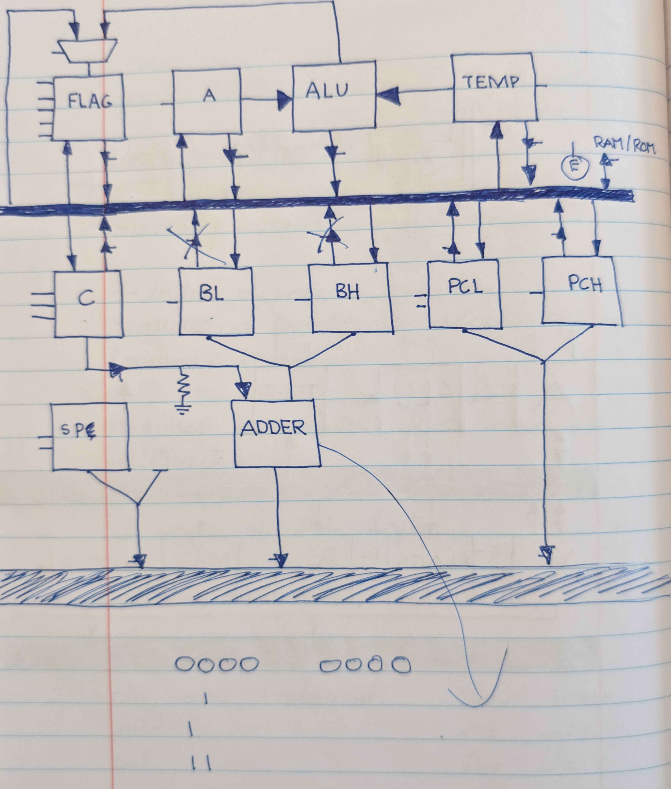
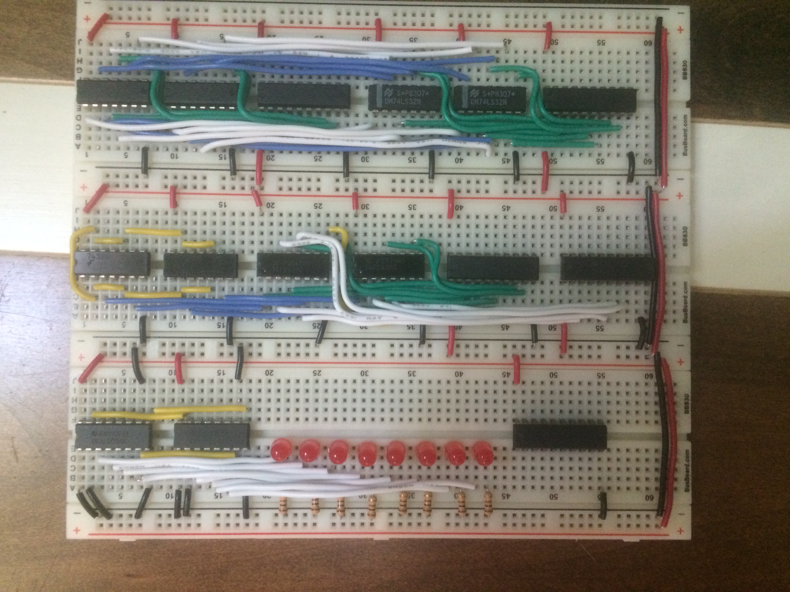
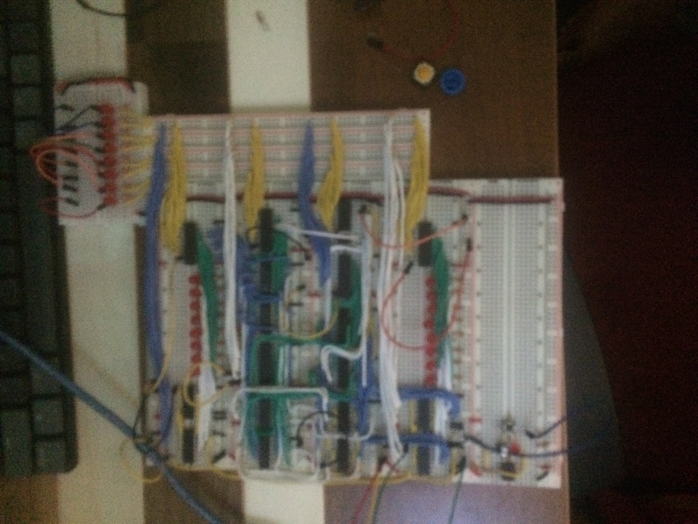

# 8-Bit Microcoded Breadboard CPU

## Overview


This project is a fully microcoded 8-bit CPU designed from scratch and implemented using 100+ 74LS-series ICs across 40+ breadboards.

The system includes:

- Custom 8-bit CISC-style instruction set (0x00–0x45 implemented)
- 8-bit data bus
- 16-bit address bus (64KB address space)
- Fully horizontal microcoded control unit (48-bit control word)
- 6 × AT28C16 EEPROM control store
- Memory-mapped I/O
- 6522 VIA interface (32 GPIO)
- Dual-port shared memory VGA subsystem
- Custom Python two-pass assembler and ROM flashing pipeline
- Working assembly programs including Snake

This is the third architectural iteration. Earlier versions exposed architectural limitations. The current version runs reliably at approximately ~1 MHz.

---

## Assembly Syntax

The assembler uses suffix symbols to indicate addressing modes:

- `$` = Immediate
- `@` = Absolute
- `#` = Indirect (pointer-based)
- `&` = Absolute + X offset
- No suffix = Implied

Example:
```
lda $10
lda @2000
lda #3000
lda &4000
inx
```

---

## Complete Instruction Encoding Table

```
0x00  lda $
0x01  lda @
0x02  lda #
0x03  lda &

0x04  ldx $
0x05  ldx @
0x06  ldx #
0x07  ldx &

0x08  inx
0x09  dex
0x0A  txa
0x0B  tax

0x0C  add $
0x0D  add @
0x0E  add #
0x0F  add &

0x10  sub $
0x11  sub @
0x12  sub #
0x13  sub &

0x14  adc $
0x15  adc @
0x16  adc #
0x17  adc &

0x18  sbc $
0x19  sbc @
0x1A  sbc #
0x1B  sbc &

0x1C  and $
0x1D  and @
0x1E  and #
0x1F  and &

0x20  orr $
0x21  orr @
0x22  orr #
0x23  orr &

0x24  shr
0x25  shl
0x26  ror
0x27  rol

0x28  sta @
0x29  sta #
0x2A  sta &

0x2B  stx @
0x2C  stx #
0x2D  stx &

0x2E  pla
0x2F  pha
0x30  plx
0x31  phx
0x32  plf
0x33  phf

0x34  xla
0x35  xlx

0x36  jsr @
0x37  rsr

0x38  clf
0x39  msk
0x3A  umk

0x3B  jmp @
0x3C  beq @
0x3D  bne @
0x3E  bmi @
0x3F  bpl @
0x40  bcs @
0x41  bcc @

0x42  ila
0x43  ilx
0x44  isa
0x45  isx
```

---

## CPU Architecture



### Registers

- A — 8-bit accumulator
- B — 8-bit helper register
- X — 8-bit index register
- SP — 8-bit stack pointer (descending from 0xFF)
- PC — 16-bit program counter
- MAR — 16-bit memory address register
- IR — 8-bit instruction register
- Flags (3-bit):
  - Zero
  - Carry
  - Negative

---

## Buses and Datapath

- 8-bit internal data bus
- 16-bit address bus
- Shared bus architecture with gated register in/out signals
- MAR handles memory addressing
- PC high/low bytes independently gated

---

## ALU Implementation

The ALU is implemented using discrete TTL logic:

- 74LS283 — Addition core
- 74LS86 — 2's Complement
- 74LS08 — AND
- 74LS32 — OR
- Shift/rotate implemented via combinational wiring and arithmetic reuse
- Flag updates controlled via microcode signals (C SET, SZ SET, etc.)

---

## Microcoded Control Unit


The CPU uses a horizontal microcode architecture.

- Microinstruction width: 48 bits
- Control store: 6 × AT28C16 EEPROMs
- Microaddress width: 11 bits
- Microaddress formation:
  opcode[7:0] || microstep[2:0]
- Maximum microsteps per instruction: 7 (+ fetch cycle)

The microstep counter increments sequentially and overflows to reset.

Conditional branches do not alter microcode sequencing.  
Instead, discrete logic gates PC load signals based on flag conditions (Z, C, S).

Each microinstruction directly drives register enables, ALU operations, bus drivers, PC control, memory read/write, and flag updates.

---

## Memory Map

Total address space: 64KB

Current configuration includes:

- 2KB ROM
- 6522 VIA (32 GPIO)
- Memory-mapped I/O
- ~512B dual-port shared RAM (VGA subsystem)

Stack resides in a dedicated page and grows downward.

---

## VGA Subsystem

The CPU integrates with a separate VGA driver module.

Features:

- Text mode output
- 25 columns × 16 rows
- Hardware-assisted scrolling
- Dual-port shared memory interface between CPU and VGA driver
- Polling-based communication

The CPU writes character data into shared dual-port memory.  
The VGA module independently reads this memory to generate video timing and pixel output.

VGA signal generation approach was inspired by Ben Eater’s methodology and adapted for this architecture.

---

## Toolchain

Custom Python-based programming pipeline:

Two-pass assembler:
- Pass 1: label resolution
- Pass 2: opcode and operand encoding

Outputs a hex array representation of machine code.

A secondary Python script converts the output into binary format for ROM flashing via XGPro.

---

## Programs Written

- Instruction verification programs
- Fibonacci sequence
- Calculator utilities
- Keypad-driven applications
- VGA name/text rendering
- Snake (fully playable)

---

## Hardware Engineering and Debugging

Major issue encountered:
- Race condition causing unintended PC double-increment due to propagation delay

Debugging involved:

- Oscilloscope-based timing analysis
- Star power distribution layout
- Extensive decoupling capacitors
- Signal integrity stabilization

System runs reliably at approximately ~1 MHz.  
Estimated current draw: ~1.2–1.6A under load.

---

## Design Influences

- Instruction set loosely inspired by 6502 concepts
- Breadboard methodology and VGA experimentation influenced by Ben Eater
- Control logic, ISA structure, microcode, and integration independently designed

---

## Future Work

- Implement machine code monitor
- Potential RISC-style redesign
- FPGA implementation exploration
- Pipelining experimentation





